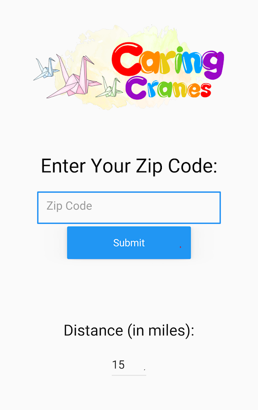
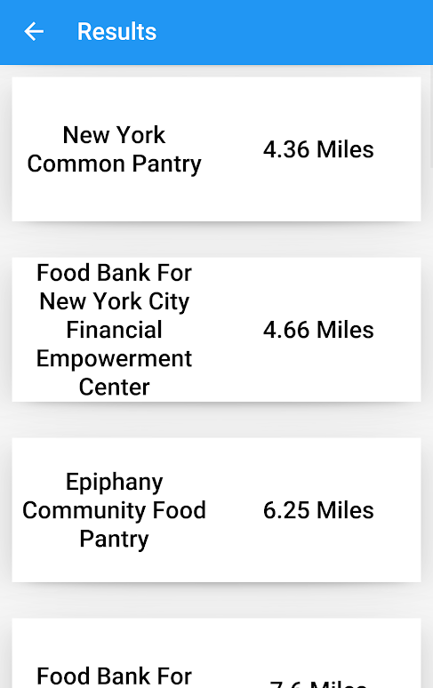
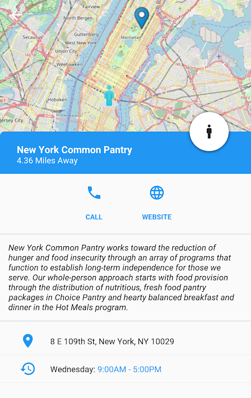
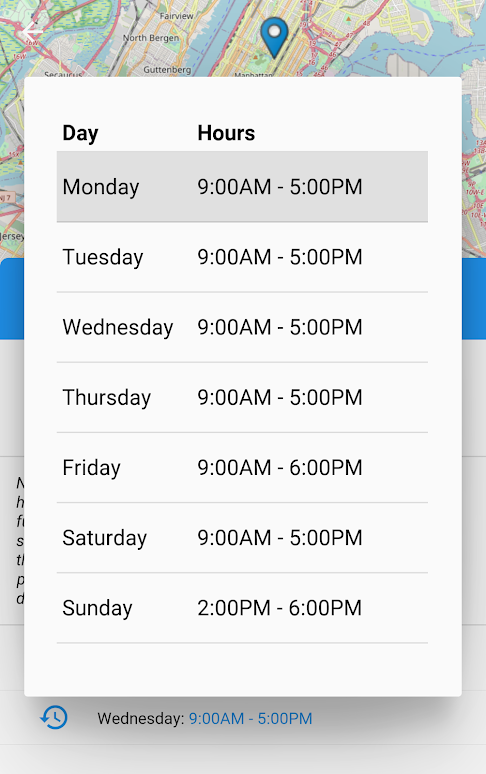

# Hidden Hunger

<h6>Caring Cranes</h6>

Inspired by the obscurity of smaller scale food organizations, Caring Cranes has decided to build Hidden Hunger to aid users in finding a food organization near their personal location.

## Table of Contents
  * [Overview](#overview)
  * [Installation](#installation)
  * [Sources](#sources)

## Overview

Smaller food organizations, often overshadowed by large food banks, find it difficult to spread information and gather volunteers. Inspired by the obscurity of smaller-scale food organizations, Caring Cranes has decided to build Hidden Hunger to aid users in finding a food organization near their personal location. With this Hidden Hunger app, users can submit their location and a directory of registered food organizations with their respective distances will appear. Users can choose from a list of organizations to get in-depth information for each food organization. For those looking for a meal or a place to volunteer, Hidden Hunger has a large directory for smaller food organizations around their location.

Currently, Hidden Hunger only has a working directory in the immediate Tri-State Area. We are continuing to expand our ever-growing database with registered food organizations, and working to port the app to IOS.

## Installation

1. Clone or download this repository.
2. Ensure you have pip, wheel, setuptools, and virtualenv in the latest version. `python3 -m pip install --upgrade pip wheel setuptools virtualenv`
3. Create a virtual environment in your terminal `virtualenv venv`.
4. Activate it `source venv/bin/activate` or `venv\Scripts\activate` for windows.
5. Install [Kivy](https://kivy.org/doc/stable/gettingstarted/installation.html) for your respective operating system. 
5. Navigate to where `requirements.txt` is and `pip install -r requirements.txt`.
6. `python3 main.py` to run project.

## Sources

Person Map Marker Icon made by Kiranshastry from [www.flaticon.com](https://www.flaticon.com/free-icon/navigation_876335?term=location%20person&page=3&position=8)

Food Bank Map Marker Icon made by Those Icons from [www.flaticon.com](https://www.flaticon.com/free-icon/pin_526780?term=map&page=1&position=83)
